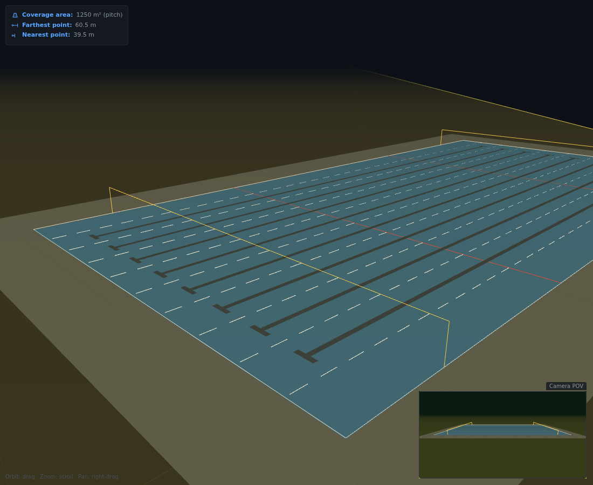

# Frustum Visualizer

Visualise what a fixed camera can see of a sports field. Position and aim a camera, set its field of view, and see its viewing frustum and ground coverage in 3D, with the covered area and nearest/farthest distances.

[Try it right now!](https://frustrum-visualiser.vercel.app/?sport=swimming-pool&L=50&W=25&cam=24,4.5,-16.5&rot=-29,-45,0&fov=102,67&view=44.36,12.5,9.14&look=-10.35,-5.43,-15.15&vfov=50)

## Run it

It's a static site with no build step, but it must be served over HTTP because it loads `sports.json`:

    npx serve .

Then open the printed URL (e.g. http://localhost:3000).

## Features

- 23 sports and venues with accurate field markings: football, cricket, tennis, basketball, ice hockey, baseball, table tennis, athletics track, swimming pool and more
- Resize any field; markings rescale sensibly
- Camera position, pitch/yaw/roll and horizontal/vertical FOV
- 3D orbit view with Top/Side/Iso/From-camera presets
- Settings are saved automatically, and the address bar is always a shareable link ("Share visualisation")

## Adding a sport

Sports are defined in [`sports.json`](sports.json): standard size, surface shape and markings in metres. See [REQ-004](requirements/2026-09-28-sport-markings-sports-json.md) for the format.

## Contributing

PR's welcome! Work follows a requirements-first process. See [AGENTS.md](AGENTS.md) and [requirements/](requirements/_index.md).

Found a problem or have an idea? [Raise a bug / Request a feature](https://github.com/nickgrealy/frustrum-visualiser/issues/new/choose).
